# Critical Events Finder

This project implements a Python function, <code>find_critical_events</code>, designed to identify "critical" events from a series of traffic data entries. An event is considered critical if it appears in two or more intersections on multiple days.

## LIVE Deploy In React.ts And Flask (May take a minute or less to load)

Use Extended_Event_Intersection_Data_Expanded.xlsx file in the repository files (its in the main repository on the first page) to upload it in the tool and check the results (critical events) or enter input by yourself in the app.

https://server-api-edmt.onrender.com/

## Swagger Docs (Server Documentation) (May take a minute or less to load)

https://server-api-edmt.onrender.com/api/docs

## Critical events finder desktop app

This is the desktop app version. check it out in this link:

https://github.com/roy845/Critical-Events-Finder-Desktop

## Table of Contents

- [Project Overview](#project-overview)
- [Flow chart of the critical events solution](#flow-chart-of-the-critical-events-solution)
- [Flow chart of the input validation](#flow-chart-of-the-input-validation)
- [Flow chart of the critical events solution (Dark)](#flow-chart-of-the-critical-events-solution-dark)
- [Flow chart of the input validation (Dark)](#flow-chart-of-the-input-validation-dark)
- [Use Case Diagram](#use-case-diagram)
- [Architecture Design](#architecture-design)
- [Technologies Used](#technologies-used)
- [Installation](#installation)
- [Usage](#usage)
- [Testing](#testing)
- [Code Walkthrough](#code-walkthrough)
- [Examples](#examples)
- [Data Structure Choice](#data-structure-choice)
- [Time Complexity Analysis](#time-complexity-analysis)
- [Screenshots](#screenshots)
- [Video demo](#video-demo)

## Project Overview

The <code>find_critical_events</code> function takes a list of days, where each day is represented by a list of tuples. Each tuple contains an intersection and an event observed at that intersection on that day. The function identifies events that:

1. Occur in at least two intersections within a single day.
2. Appear on multiple days, satisfying the intersection requirement each time.

## Flow chart of the critical events solution

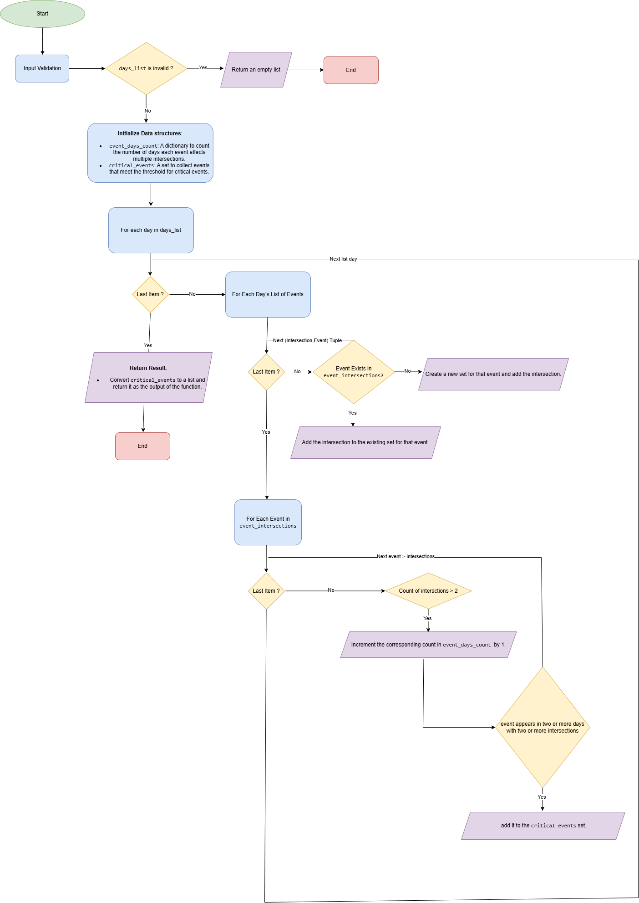

## Flow chart of the input validation

## Flow chart of the critical events solution (Dark)

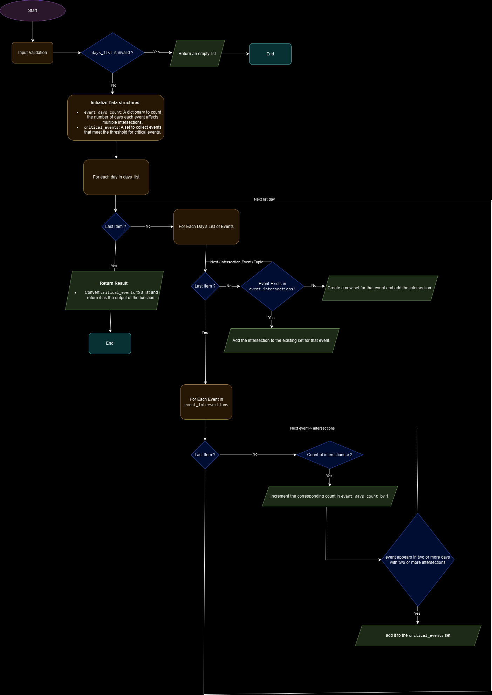

## Flow chart of the input validation (Dark)

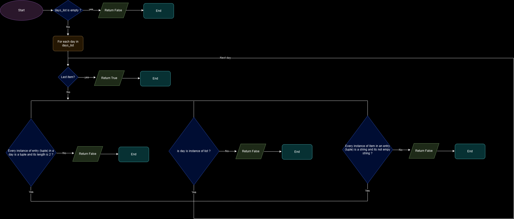

## Use Case Diagram

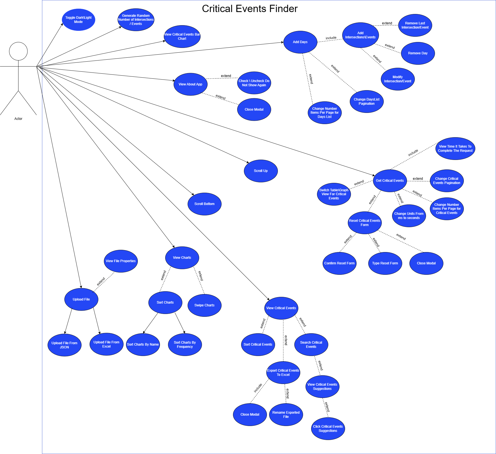

## Architecture Design

## Technologies Used

| **Technology**     | **Logo**                                                                                                                                                                      |
| ------------------ | ----------------------------------------------------------------------------------------------------------------------------------------------------------------------------- |
| **Docker**         |                                                       |
| **Docker Compose** |                                          |
| **React**          |                                                                         |
| **Redux**          |                                                                                    |
| **TailwindCSS**    |  |
| **TypeScript**     |  |
| **Python**         |                                                                                                                    |
| **Flask**          |                                          |

## Installation

Clone the repository and ensure you have the latest Python installed on your machine.

1. <b> git clone </b> https://github.com/roy845/Critical-Events-Finder.git

2. <b> cd itc_q2 </b>

3. After you changed the directory to <b> itc_q2 </b> install the virtual environment using the command: <b> python -m venv venv </b>

4. Active the virtual environment using the command: <b> .\venv\Scripts\activate </b>

5. Upgrade pip using the command:
   <b> python -m pip install --upgrade pip </b>

6. Run the command: <b> pip install -r requirements.txt </b>

## Usage

To use the <code>find_critical_events</code> function, you can call it with a list of days. Each day should be a list of tuples, where each tuple contains an intersection and an event.

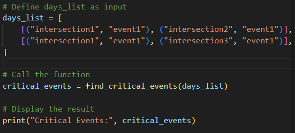

Go to the main.py file and run the command python main.py
and the results will show up in the terminal of your IDE.

## Testing

To test the function find_critical_events ensure you are in the <b> itc_q2 </b> directory and the virtual environment you install in the previous step is activated using the command: <b> .\venv\Scripts\activate. </b>
once the environment is activated hit the command <b>pytest</b> in the terminal and the test would run immediately.

## Code Walkthrough

1. <b>Parameters:</b>

   - <b>days_list (List of Lists):</b> Each list represents a day containing tuples of intersection-event pairs.

2. <b> Function Logic:</b>

   - <b> Validating Days List Structure:</b> Before processing, validate the days_list structure to ensure it is a non-empty list of lists containing tuples, with each tuple holding exactly two non-empty strings. If the days_list does not meet this format, return an empty list to prevent further processing.

   - <b> Tracking Intersections:</b> For each event on a given day, track the unique intersections it appears in.

   - <b> Counting Days:</b> If an event appears in at least two intersections in a day, increase its count for that day.

   - <b> Identifying Critical Events:</b> An event is critical if it appears on two or more days with at least two intersections on each of those days.

3. <b>Data Structures:</b>

   - <b> event_days_count (dictionary):</b> Tracks how many days each event appears with sufficient intersections.

   - <b> event_intersections (dictionary of sets):</b> Tracks intersections for each event on a single day.

   - <b> critical_events (set): </b> collect events that meet the critical threshold.

   - <b>days_list (list of lists of tuples): </b> represents multiple days of events with each day's events as a list of
     tuples, and each tuple includes an intersection and an event.

## Examples

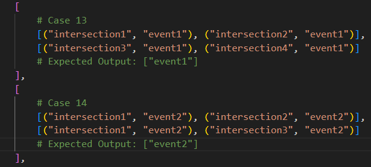

## Data Structure Choice

1. <b> defaultdict with set for event_intersections:</b>

- event_intersections is a dictionary where each event key points to a set of intersections it appears in.

  - defaultdict(set) allows automatic initialization of empty sets when a new key is
    encountered, making it ideal for this use case as it avoids explicitly checking for the
    existence of a key before adding to it.

  - Set as values is chosen to prevent duplicate intersections for an event, as only unique
    intersections are needed. Adding elements to a set is average O(1), ensuring efficiency.

2. <b> defaultdict with int for event_days_count: </b>

- event_days_count keeps track of the number of days each event appears in multiple intersections.

  - defaultdict(int) provides a counter structure, initializing integer values to zero by
    default, which makes it easy to increment without checking if the key exists.

  - The integer counters allow simple addition operations, maintaining an average O(1) time complexity per update.

3.  <b> set for critical_events: </b>

- critical_events is a set to collect events that meet the critical threshold
  (appearing on multiple days in multiple intersections).

  - Set structure is chosen because it automatically manages unique entries without
    duplicates, which is essential since events shouldn’t be counted multiple times once
    they are identified as critical.

  - Membership checks and additions in a set are average O(1), which helps keep the operation efficient.
    Lists (List[Tuple[str, str]] and List[List[Tuple[str, str]]]):

4. <b> Lists (List[Tuple[str, str]] and List[List[Tuple[str, str]]]): </b>

- days_list represents multiple days of events with each day's events as a list of
  tuples, and each tuple includes an intersection and an event.

  - Lists provide a simple and direct way to hold ordered data without needing to enforce
    uniqueness. They are convenient to iterate over and have an O(1) access time for elements, making them suitable for this structure, especially since we’re
    iterating over each day and its events sequentially.

  - Lists of tuples allow compact storage and make the relationship between intersection
    and event straightforward to process.

## Time Complexity Analysis

1. <b> is_valid_days_list </b>
   The is_valid_days_list function validates that days_list is a non-empty list of lists containing tuples,
   where each tuple has exactly two non-empty strings.

- <b> Checking if days_list is empty: </b>

  - <b> The check if not days_list: </b> is O(1).

- <b> Outer Loop (over days_list): </b>

  - The function iterates over each day in days_list, which has D days. This loop runs D times.

- <b> Inner Loop (over each entry in day): </b>

  - For each day, it iterates over each entry, which contains an (intersection, event) tuple.
    Let E represent the average number of entries per day.

  - This loop executes E times for each day, leading to a total of O(D×E) iterations across all days.

- <b> Validation of each entry:</b>

  - Each entry check, including checking the tuple type, length, and that each element is a non-empty string, takes O(1).

<b> Therefore, the time complexity of is_valid_days_list is:</b> O(D×E)

2. <b> update_event_intersections </b>
   The update_event_intersections function creates a dictionary (event_intersections) where each event maps to a set of intersections
   it appears in for a given day.

- <b> Loop over each entry in day:</b>

  - The function iterates over each (intersection, event) pair in day.
  - This loop runs E times for the given day.

- Insertion into event_intersections:
  - For each event, adding an intersection to a set takes O(1) on average, making the entire loop O(E).

<b> Thus, the time complexity of update_event_intersections is:</b> O(E)

3. <b> update_event_days_count </b>
   The update_event_days_count function updates the count of days each event appears in multiple intersections and adds critical events to
   the critical_events set if they meet a specific threshold.

- <b> Loop over event_intersections: </b>

  - The function iterates over each event and its set of intersections in event_intersections.
  - Since there are at most E events per day, this loop is O(E).

- <b> Condition Checks and Updates: </b>
  - Checking if intersections has at least two entries, incrementing event_days_count, and potentially adding an event to critical_events
    each take O(1) on average.

<b> Thus, the time complexity of update_event_days_count is: </b>O(E)

4. <b> find_critical_events </b>
   The find_critical_events function uses is_valid_days_list, update_event_intersections, and update_event_days_count
   to find critical events across multiple days.

- <b> Validation of days_list: </b>

  - is_valid_days_list(days_list) runs with complexity O(D×E).

- <b> Outer Loop (over days_list): </b>

  - The main loop iterates over each day in days_list, which runs D times.

- <b> Processing Each Day: </b>

  - For each day, it calls update_event_intersections (with complexity O(E)) and update_event_days_count (with complexity O(E)), resulting in O(E)+O(E)=O(E) for each day.

<b> Thus, the total time complexity of find_critical_events, including the validation step, is:</b> O(D×E)+O(D×E)=O(D×E)

<b> Summary of Overall Complexity </b>
<b> The total time complexity for the find_critical_events function, accounting for all helper functions, is: </b>O(D×E)

<b> where: </b>

- D is the number of days in days_list.
- E is the average number of events per day.

## Screenshots

<b> Info Dialog </b>

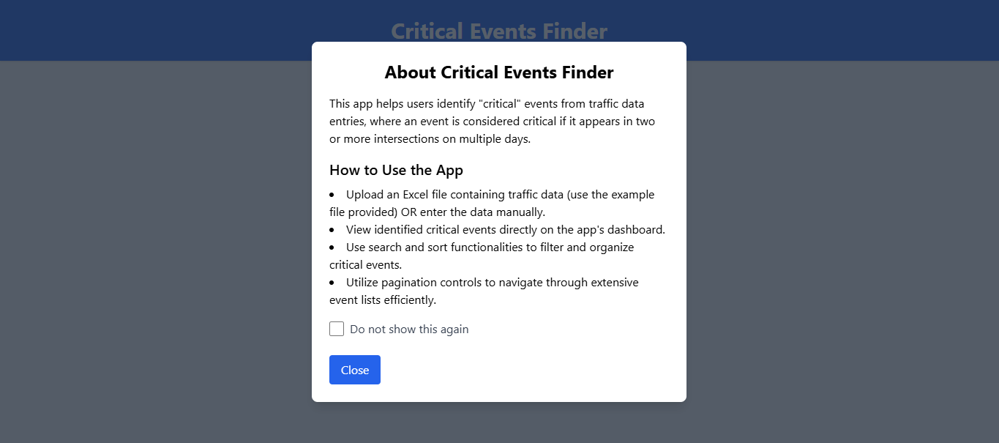

<b> Dark Mode ON </b>

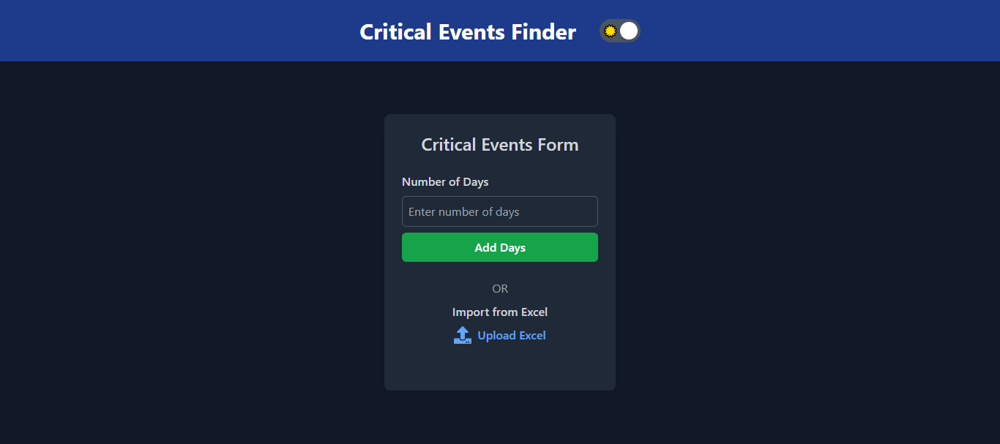

<b> Landing Page </b>

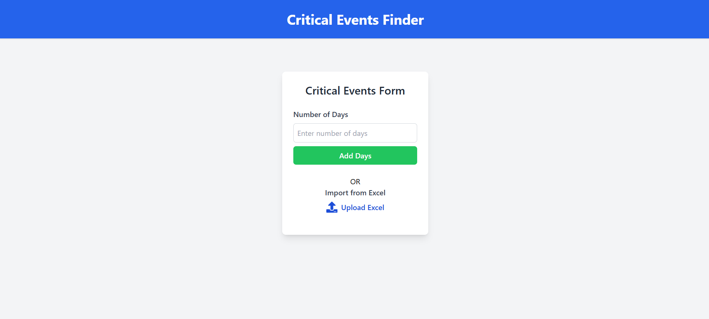

<b> Adding days </b>

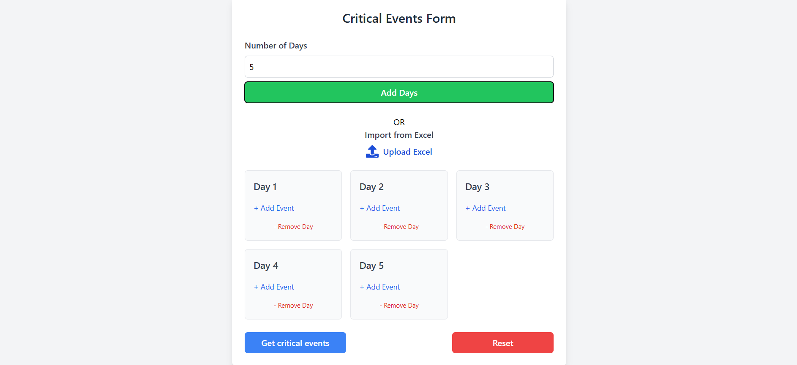

<b> Adding (intersection,event)s </b>

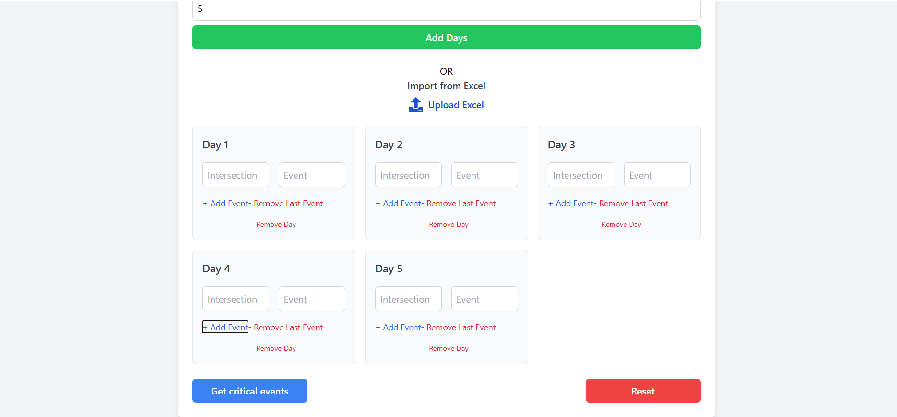

<b> Adding incorrect file format (Other than Excel) </b>

<b> Adding data from Excel </b>

<b> Adding data from JSON</b>

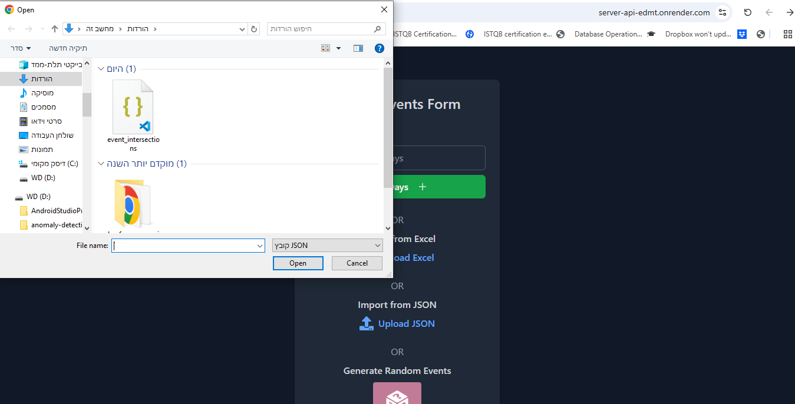
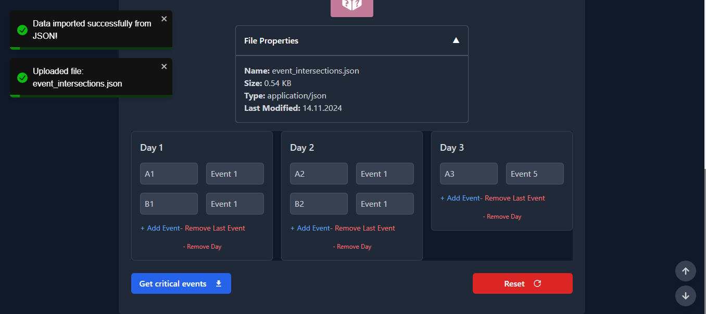

<b>File Settings / Properties</b>

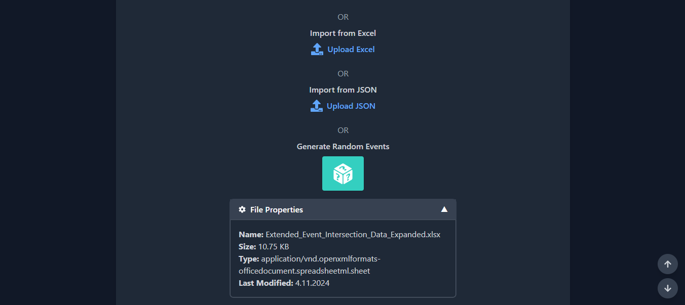

<b>Intersections / Events Charts</b>

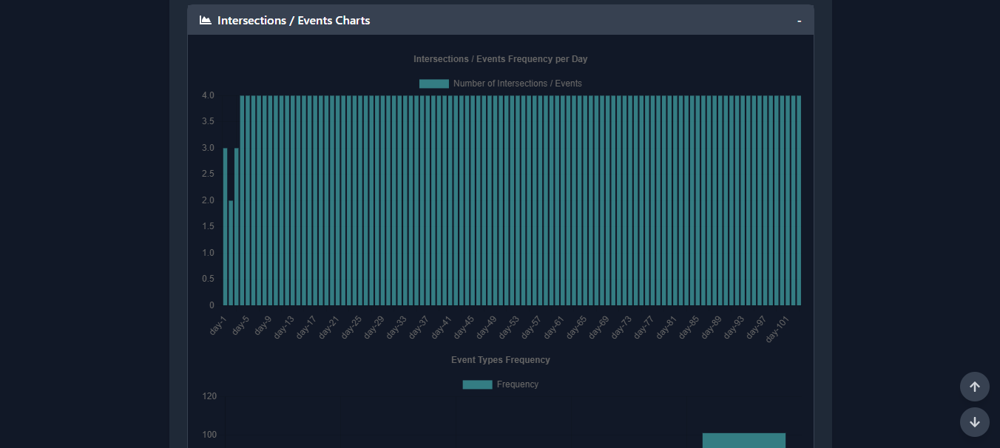
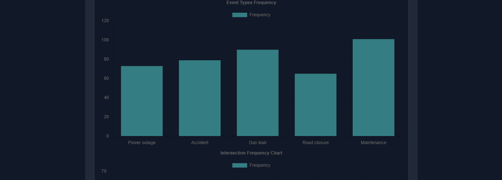

<b> Swipeable Intersections / Events Charts </b>

Use the arrows to swipe graphs or hold the mouse click and swipe to left/right.

<b> Generating Random Number Of Days With Random Number of Intersections / Events

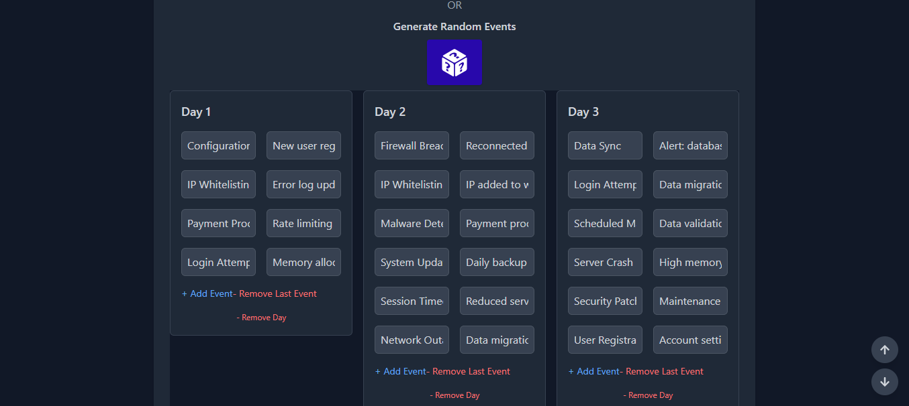

<b> Generating results:(Critical Events) </b>

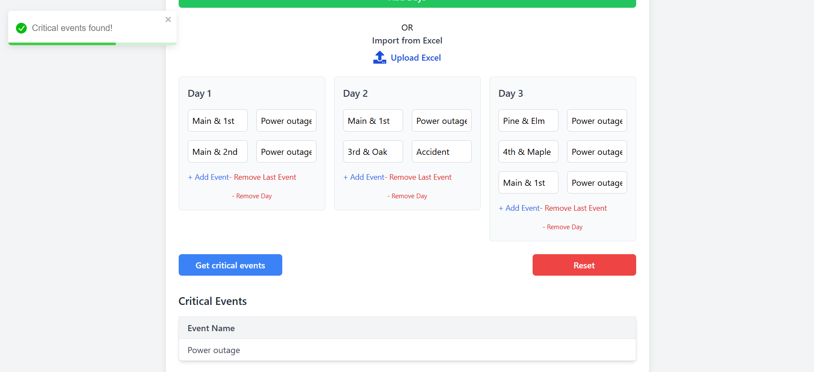

<b> Reset Form </b>

<b>Search Critical Events </b>

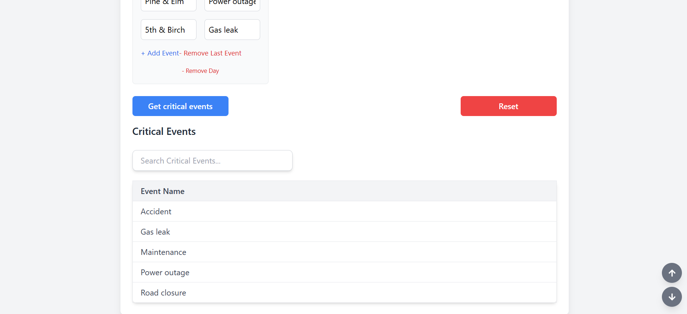

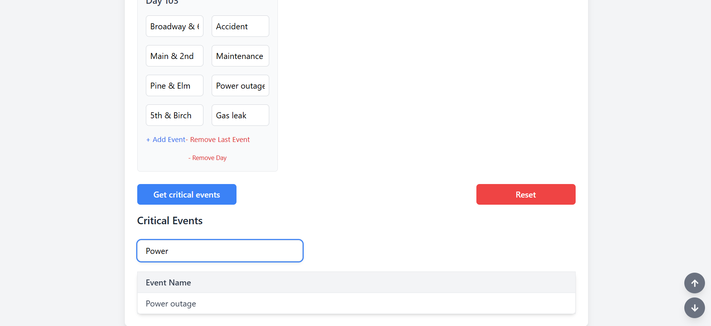

<b>Autocomplete using Trie data structure</b>

<b> Sort Critical results </b>

<b> Sort Critical results ascending </b>

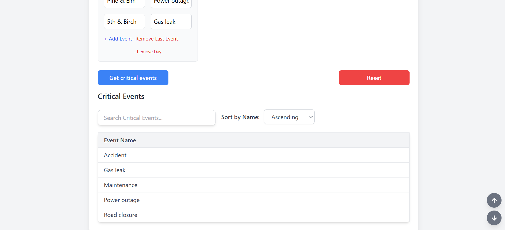

<b> Sort Critical results descending </b>

<b> Critical Events Pagination </b>

<b>Choosing items per page</b>

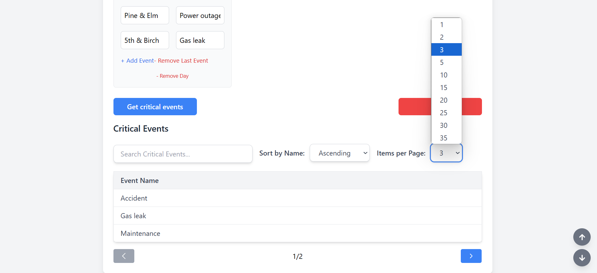

<b>Export table data to an Excel file</b>

<b> Change Exported file name </b>

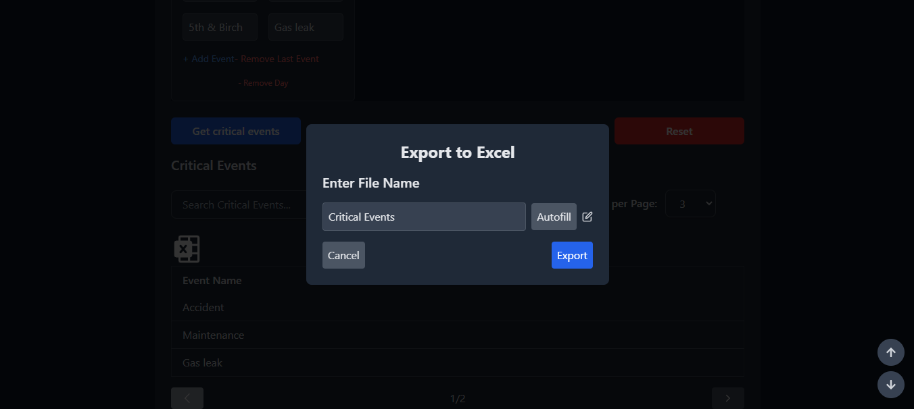

<b> Graphs Section </b>

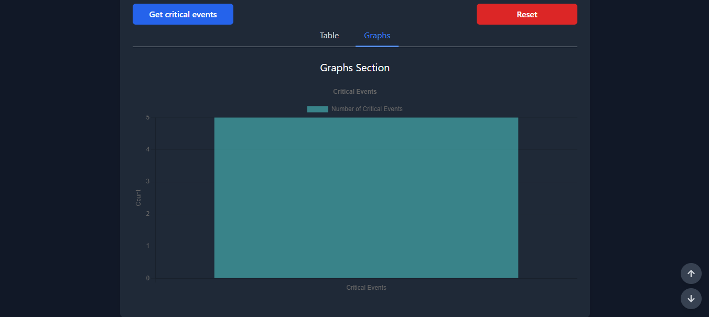

<b> Invalid days number input </b>

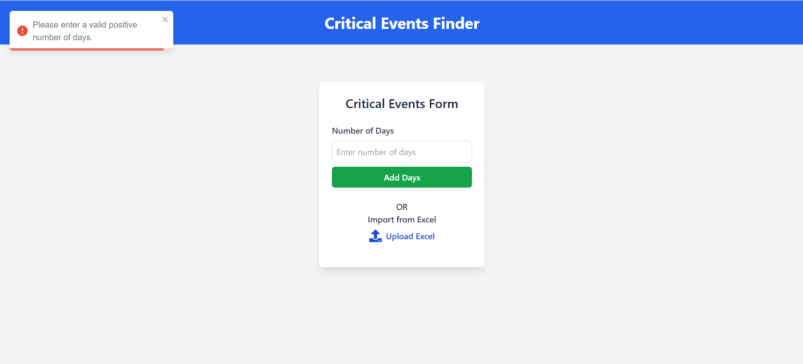

<b> Negative days number input </b>

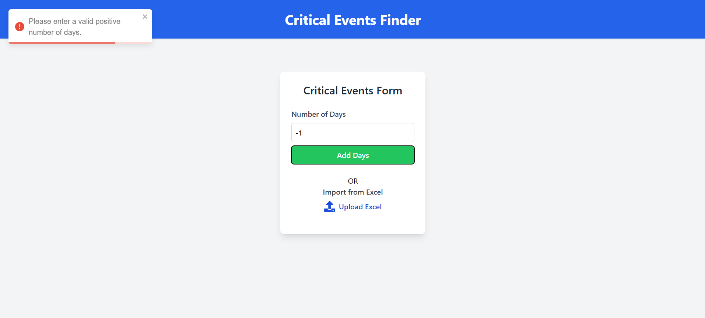

## Video demo

Click on the image and you will transfer to the youtube video showing the video demo of the tool.

