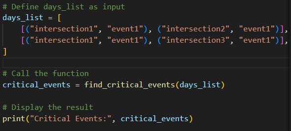
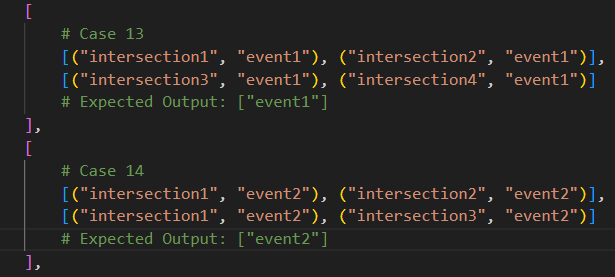

# Critical Events Finder

This project implements a Python function, <code>find_critical_events</code>, designed to identify "critical" events from a series of traffic data entries. An event is considered critical if it appears in two or more intersections on multiple days.

## Table of Contents

- [Project Overview](#project-overview)
- [Technologies Used](#technologies-used)
- [Installation](#installation)
- [Usage](#usage)
- [Code Walkthrough](#code-walkthrough)
- [Examples](#examples)
- [Time Complexity Analysis](#time-complexity-analysis)

## Project Overview

The <code>find_critical_events</code> function takes a list of days, where each day is represented by a list of tuples. Each tuple contains an intersection and an event observed at that intersection on that day. The function identifies events that:

1. Occur in at least two intersections within a single day.
2. Appear on multiple days, satisfying the intersection requirement each time.

## Technologies Used

## Installation

Clone the repository and ensure you have Python 3.6+ installed. This function relies only on the standard Python library, so no additional packages are required.

git clone https://github.com/roy845/Critical-Events-Finder.git
cd itc_q2

## Usage

To use the <code>find_critical_events</code> function, you can call it with a list of days. Each day should be a list of tuples, where each tuple contains an intersection and an event.

## Code Walkthrough

1. <b>Parameters:</b>

   - <b>days_list (List of Lists):</b> Each list represents a day containing tuples of intersection-event pairs.

2. <b> Function Logic:</b>

   - <b> Tracking Intersections:</b> For each event on a given day, track the unique intersections it appears in.
   - <b> Counting Days:</b> If an event appears in at least two intersections in a day, increase its count for that day.

   - <b> Identifying Critical Events:</b> An event is critical if it appears on two or more days with at least two intersections on each of those days.

3. <b>Data Structures:</b>

   - <b> event_days_count (dictionary):</b> Tracks how many days each event appears with sufficient intersections.
   - <b> event_intersections (dictionary of sets):</b> Tracks intersections for each event on a single day.

## Examples

## Time Complexity Analysis

The function’s time complexity is <b> O(D \* E) </b>, where:

<b>D:</b> The number of days in days_list.
<b>E:</b> The average number of intersections/events per day.

<b>Explanation:</b>
<b>Outer Loop:</b> The function iterates over each day in days_list, taking <b>O(D)</b> time.
<b>Inner Loop:</b> Within each day, the function processes E intersections/events, resulting in <b>O(D \* E)</b> total time complexity.
<b>Dictionary Operations:</b> Adding elements to a set and accessing dictionary values are average <b>O(1)</b> operations, contributing minimally to the overall complexity.
